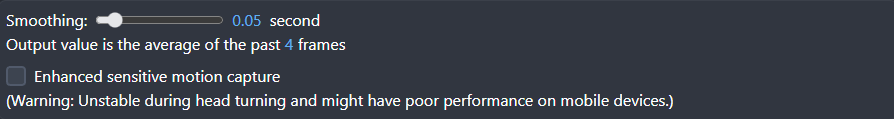
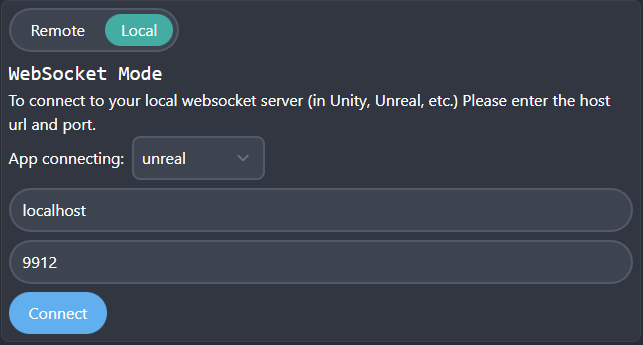
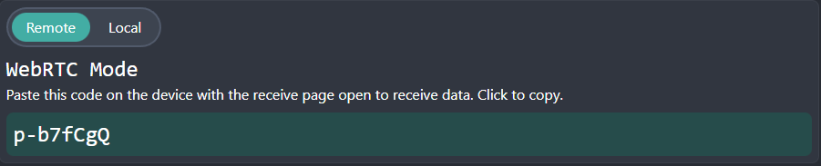
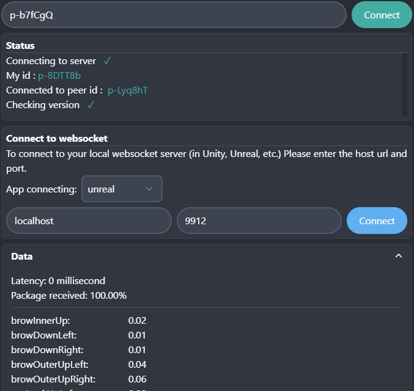
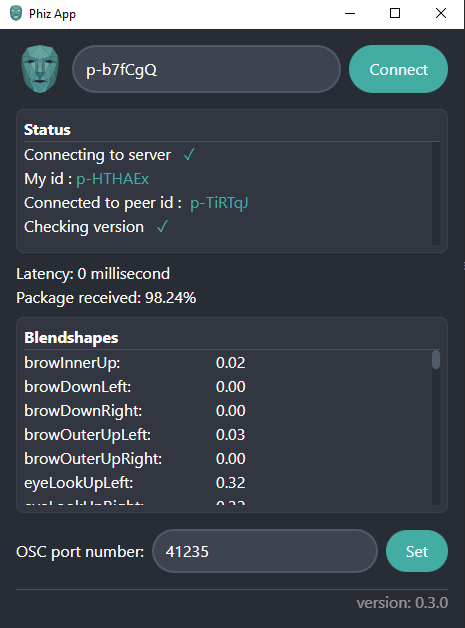

## What is Phiz?
Phiz lets you do facial motion capture right in your browser using your webcam on any mobile device or computer. You can then send the data to another browser, popular game engine or broadcast as OSC data using Phiz's crossplatform app.

## How does it work?
- Facial motion capture in your browser

    Phiz uses a combination of [Mocap4face](https://github.com/facemoji/mocap4face) and [Google mediapipe](https://github.com/google/mediapipe) machine learning model for motion capture.**No iPhone lidar or RGBD camera needed!** This is also not fixed and will be updated whenever there is a better model.
- Streaming data browser to browser & browser to OSC app

    Phiz uses WebRTC (same protocal as you do video calling) to send data from browser to browser and browser to app. However, no image or video is sent at all. WebRTC also allow us to have peer-to-peer secure connection and low latency.

- Unreal and Unity support

    Phiz include custom plugins that fires up WebSocket servers within [Unreal engine](https://www.phizmocap.dev/docs/unreal/basic-usage) and [Unity](https://www.phizmocap.dev/docs/unity/basic-usage) to receive live data from your browser.

- ARKit support

    Phiz uses the same blendshapes as arkit. Checkout [the specs page](https://www.phizmocap.dev/docs/specs/blendshapes) for the blendshape names and orders.

## How do I use it?
**Important! The browser page needs to be active when recording. If you closed your phone, refresh the page to generate a new code.**

Navigate to the [capture page](https://www.phizmocap.dev/capture) and allow the website to use your camera. You can then select the smoothing of the frame and select different types of motion capture ML model.

There are two ways to send the captured data.

### Local

In local mode, using Phiz's custom plugin you can send the data to directly inside [Unreal engine](https://www.phizmocap.dev/docs/unreal/basic-usage) or [Unity](https://www.phizmocap.dev/docs/unity/basic-usage) with your defined url and port. See the documents for more details.

### Remote

Click on the 8 character code to copy.

#### Sending the data to another device

Open up the [receive page](https://www.phizmocap.dev/receive) on another device. Paste the 8 character code your just copied. You should see the data live streaming on your device now :).

#### Sending the data to Phiz App to broadcast OSC data

Install the [Phiz App](https://github.com/SpookyCorgi/phiz/releases/latest) for your platform. Open the app and paste the 8 character code. Now the data will be avaible in OSC format in your choosen port.

## Plugins
### Unity
1. Download the latest Unity file (phiz-unity-vx.x.x.zip) from the [release page](https://github.com/SpookyCorgi/phiz/releases/latest)
2. Unzip it and drag all the files inside your Unity Assets folder.
3. Check out [Example.cs](https://github.com/SpookyCorgi/phiz/blob/main/plugins/unity/Example.cs) for basic usage. (It's also included in the release zip.)

Check out the [docs](https://www.phizmocap.dev/docs) for more examples!
- [Unity Basic Usage](https://www.phizmocap.dev/docs/unity/basic-usage)
- [Unity Ready Player Me Example](https://www.phizmocap.dev/docs/unity/ready-player-me-example)

### Unreal
1. Download the latest Unreal file (phiz-unreal-vx.x.x.zip) from the [release page](https://github.com/SpookyCorgi/phiz/releases/latest)
2. Unzip it. Copy the Plugins folder to inside your project's root folder.
3. Restart Unreal. Now all the necessary modules will be automatically compiled.

Check out the [docs](https://www.phizmocap.dev/docs) for instant setup for metahuman and other ways for common avatars.
- [Unreal Engine Basic Usage](https://www.phizmocap.dev/docs/unity/basic-usage)
- [Unreal Enigine Metahuman Example](https://www.phizmocap.dev/docs/unreal/metahuman-example)

## OSC App
Phiz also comes with Windows, MacOS and Linux apps. It can be used to receive data from the website and send OSC data to any software on your desktop.

1. Download the latest app for your platform from the [release page](https://github.com/SpookyCorgi/phiz/releases/latest)

2. See [App Installation](https://www.phizmocap.dev/docs/osc-app/app-installation) for installing the app. Apple and Microsoft will say my app is a virus if I don't pay them loads of money every year. This is an opensource project. You can check the source code yourself.

3. Enter the 8 character code (eg, p-AwCodE). If successfully connected, you should see the incoming data.

4. Enter the port for OSC data to be sent to. Now the data are available everywhere on your computer :)

Checkout the [PureData example](https://www.phizmocap.dev/docs/osc-app/puredata-example) for using the 52 blendshapes as a synthesizer. 

## Data format
**All data follows the OSC format.
There are currently 4 channels of data.**
- **/phiz/blendshapes**
  
  A float array [52 blendshape values] ranging from 0.0~1.0. **Check [here](https://github.com/SpookyCorgi/phiz/wiki/Blendshapes-Format) for the order of blendshapes**. 
  
  Currently the website only supports detecting 41/52 blendshapes. However the array still have a length of 52 with non-detecting blendshapes being 0.0.
  
- **/phiz/headRotation**
    
   A float array [x,y,z,w] ranging from -1.0 ~ 1.0. 

These are extra eye rotation roughly estimated from the eyeLookAt blendshapes. It's usually not needed since common avatar has eye rotation build in their blendshapes.
- **/phiz/leftEyeRotation**

   A float array [x,y,z,w] ranging from -1.0 ~ 1.0.
   
- **/phiz/rightEyeRotation**

    A float array [x,y,z,w] ranging from -1.0 ~ 1.0.

All rotations are **quaternions in right-handed, Y-Up, Z-Forward** coordinate system.

## Features
- Website:
    - Face tracking:
        - [x] 41/52 arkit compatible expression blendshapes (achieved by mocap4face)
        - [X] Custom support for the remain 11 arkit blendshapes (achieved by mediapipe)
        - [x] Head position and rotation quaternion
        - [x] Eye rotation output
    - Face mesh:
        - [ ] 468 face mesh points
        - [ ] Face mesh texture with UV
    - Audio:
        - [ ] Audio channel
    - Advanced:
        - [ ] Upload custom avatar to preview
        - [X] Min, max and curve slider for custom blendshape control
        - [ ] User profile for saving control settings
        - [X] User-upload-avatar streaming page for obs browser source

- Desktop app:
    - [x] OSC data output
    - [x] Dynamic port selection
    - [ ] Support for multiple mocap input

- 3rd party:
    - Unreal Engine:
        - ~~[x] Embedded web server (replacing the desktop app)~~
        - [x] Websocket server plugin for connection
        - [x] Example project for ready player me
        - [x] Example project for metahuman

    - Unity:
        - ~~[ ] Embedded web server (replacing the desktop app)~~
        - [x] Websocket server plugin for connection
        - [x] Example project for ready player me
        - [x] Multiple mocap support

    - VRChat:
        - [ ] Output support for VRChat
        - [ ] Example project for VRChat  
    - VtuberStudio

## License
The project is under GNU GPLv3 license. Credits are appreciated.

